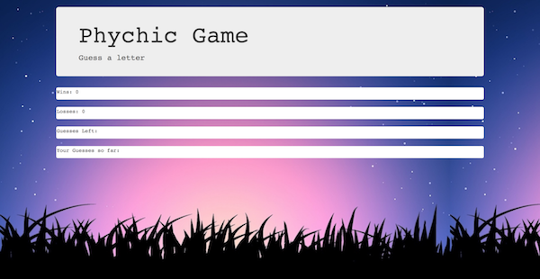
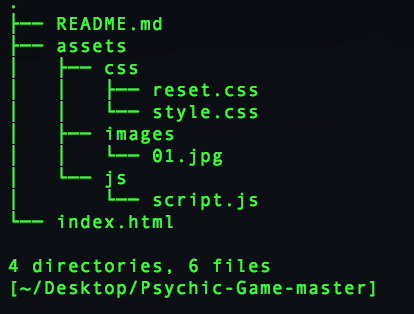

## Test the Game
https://robydoidao2006.github.io/Psychic-Game/

What the Game Looks like.

## Rules of the Game
- Simply start guessing letters by pressing them on your keyboard.
- You have 10 guesses and there is 26 letters to guess from.

## This app was build using:
- HTML
- CSS
- Javascript

## How to Run the Game Localy
- Clone / Download the repository.
- Unzip the file.
- Drag and drop the unzip folder on a text editor of your choice.
- Look for the index.html and get it to display on the text editor, right click and open on browser(or coomand b)
- Your default browser should open and load the Game automatically.

## Folder Structure

## Future Improvements 
- When user wins or loses there is a pop-up message that displays the outcome, but when you click on it, it will not reset the game unless you press a letter.
- Maybe some music ??

